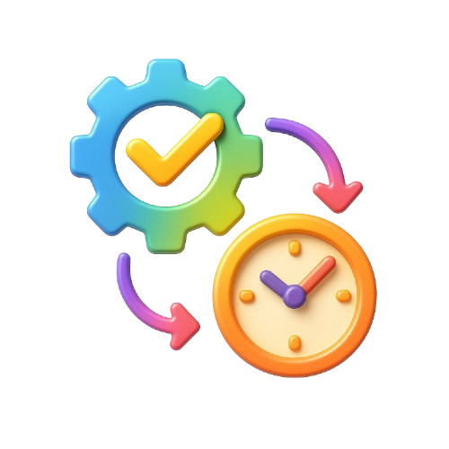

# Cooper

<p align="center">
  
</p>

<p align="center">
  <strong>现代化的工作流自动化平台 - 让自动化触手可及</strong>
</p>

<p align="center">
  <a href="https://github.com/CooperJiang/Cooper">
    
  </a>
  <a href="https://github.com/CooperJiang/Cooper/blob/main/LICENSE">
    
  </a>
  <a href="https://golang.org">
    
  </a>
  <a href="https://vuejs.org">
    
  </a>
</p>

<p align="center">
  <a href="#-特性">特性</a> •
  <a href="#-快速预览">预览</a> •
  <a href="#-技术栈">技术栈</a> •
  <a href="#-在线体验">在线体验</a> •
  <a href="./docs/DEVELOPMENT_GUIDE.md">开发文档</a>
</p>

---

## ✨ 特性

Cooper 是一个强大而优雅的工作流自动化平台，旨在让自动化变得简单、可靠和愉悦。

### 🎯 核心能力

- **🎨 可视化工作流编排** - 拖拽式流程设计，直观清晰的节点连接
- **⏰ 灵活的调度系统** - 支持 Cron、定时、Webhook 等多种触发方式
- **🔗 丰富的节点类型** - HTTP 请求、条件判断、延迟、循环等内置节点
- **📊 实时执行监控** - 可视化执行状态，详细的日志追踪
- **🔐 企业级安全** - JWT 认证、权限管理、数据加密
- **🚀 高性能引擎** - Go 后端保障稳定性和性能

### 💡 使用场景

- **API 自动化测试** - 定时执行接口测试，监控服务健康
- **数据同步** - 定期同步不同系统间的数据
- **自动化运维** - 定时备份、清理、健康检查
- **消息通知** - 邮件、Webhook 通知集成
- **业务流程自动化** - 复杂的业务逻辑编排和执行

---

## 🖼 快速预览

<p align="center">
  
</p>

提供了现代化的用户界面，让工作流的创建、管理和监控变得直观简单。

---

## 🛠 技术栈

### 后端技术

- **Go 1.21+** - 高性能、高并发的后端服务
- **Gin** - 轻量级 Web 框架
- **GORM** - 优雅的 ORM 数据库操作
- **Cron v3** - 可靠的定时任务调度
- **JWT** - 安全的身份认证

### 前端技术

- **Vue 3** - 渐进式前端框架，完整的 Composition API
- **TypeScript** - 类型安全的 JavaScript 超集
- **Vite** - 下一代前端构建工具
- **Tailwind CSS** - 现代化的原子化 CSS 框架
- **Pinia** - 轻量级状态管理
- **VueFlow** - 强大的流程图编辑器

### 数据库

- **MySQL 8.0+** - 生产环境推荐
- **SQLite** - 开发和轻量级部署

---

## 🌐 在线体验

我们提供了在线演示环境，您可以直接体验 Cooper 的强大功能：

**🔗 体验地址**: [https://task.mmmss.com/](https://task.mmmss.com/)

---

## 🚀 快速开始

### 前置要求

- Go 1.21+
- Node.js 18+
- pnpm (推荐) 或 npm
- MySQL 8.0+ (生产环境) 或 SQLite (开发环境)

### 安装步骤

```bash
# 1. 克隆项目
git clone https://github.com/CooperJiang/Cooper.git
cd Cooper

# 2. 配置环境
cp config.example.yaml config.yaml
# 编辑 config.yaml 配置数据库等信息

# 3. 启动服务（推荐使用 Makefile）
make start

# 或者手动启动
# 终端1: 启动后端
go run cmd/main.go

# 终端2: 启动前端
cd web && pnpm install && pnpm dev
```

### 访问应用

- **前端界面**: http://localhost:3200
- **后端 API**: http://localhost:7777

详细的安装和配置说明，请查看 [开发文档](./docs/DEVELOPMENT_GUIDE.md)。

---

## 📖 文档

我们提供了完整的文档来帮助您快速上手和深入使用 Cooper：

- **[开发指南](./docs/DEVELOPMENT_GUIDE.md)** - 详细的开发环境搭建和开发流程
- **[组件开发规范](./docs/COMPONENT_DEVELOPMENT.md)** - 前端组件开发标准和最佳实践
- **[主题系统规范](./docs/THEME_SPEC.md)** - 完整的主题和样式系统文档
- **[工作流设计文档](./docs/workflow-design.md)** - 工作流引擎架构和设计理念

---

## 🎯 功能亮点

### 🎨 可视化工作流编辑器

- 拖拽式节点创建和连接
- 实时验证和错误提示
- 支持节点复制、删除、批量操作
- 自动布局和对齐

### 📊 丰富的节点类型

**触发器节点**
- 定时触发（Cron 表达式）
- Webhook 触发
- 手动触发

**执行节点**
- HTTP 请求（支持所有 HTTP 方法）
- 邮件发送
- 延迟等待

**控制节点**
- 条件判断
- 循环遍历
- 并行执行

### 🔄 灵活的调度系统

- **Cron 表达式** - 灵活的定时配置
- **固定间隔** - 按固定时间间隔执行
- **Webhook** - 通过 HTTP 请求触发
- **手动执行** - 一键手动触发工作流

### 📈 实时监控和日志

- 工作流执行状态实时更新
- 详细的节点执行日志
- 执行历史记录查询
- 错误追踪和告警

---

## 🏗 架构设计

Cooper 采用现代化的前后端分离架构：

```
┌───────────────────────────────────────────────┐
│          前端层 (Vue 3 + TypeScript)           │
│                                               │
│  工作流编辑器  │  执行监控  │  任务管理  │  用户中心 │
│                                               │
└───────────────────┬───────────────────────────┘
                    │ RESTful API
                    ▼
┌───────────────────────────────────────────────┐
│           后端层 (Go + Gin Framework)          │
│                                               │
│  API 网关  │  工作流引擎  │  调度器  │  认证服务 │
│                                               │
└───────────────────┬───────────────────────────┘
                    │
                    ▼
┌───────────────────────────────────────────────┐
│            数据层 (MySQL/SQLite)               │
│                                               │
│  工作流定义  │  执行历史  │  用户数据  │  日志   │
│                                               │
└───────────────────────────────────────────────┘
```

**核心模块**：
- **工作流引擎**：负责工作流的解析、验证和执行
- **调度器**：基于 Cron 的任务调度系统，支持多种触发方式
- **执行器**：异步执行工作流节点，支持并发和错误处理

详细的架构设计请参考 [工作流设计文档](./docs/workflow-design.md)。

---

## 🤝 贡献指南

我们欢迎所有形式的贡献！无论是报告 Bug、提出新功能建议，还是提交代码。

1. Fork 本仓库
2. 创建您的特性分支 (`git checkout -b feature/AmazingFeature`)
3. 提交您的更改 (`git commit -m 'Add some AmazingFeature'`)
4. 推送到分支 (`git push origin feature/AmazingFeature`)
5. 开启一个 Pull Request

更多开发规范请查看 [开发文档](./docs/DEVELOPMENT_GUIDE.md) 和 [组件开发规范](./docs/COMPONENT_DEVELOPMENT.md)。

---

## 📝 路线图

### ✅ 已完成

- [x] 可视化工作流编辑器
- [x] 基础节点类型（HTTP、条件、延迟等）
- [x] 工作流调度和执行引擎
- [x] 用户认证和权限管理
- [x] 执行历史和日志查询
- [x] 管理后台

### 🚧 进行中

- [ ] 工作流模板市场
- [ ] 更多节点类型（数据库、文件操作等）
- [ ] WebSocket 实时推送
- [ ] 工作流版本管理

### 💡 计划中

- [ ] AI 辅助工作流生成
- [ ] 工作流性能分析
- [ ] 更多第三方集成
- [ ] 移动端支持
- [ ] 国际化支持

---

## 📄 License

本项目采用 [MIT License](LICENSE) 开源协议。

---

<div align="center">

### 🌟 如果这个项目对你有帮助

**请给我们一个 Star ⭐️**

[](https://star-history.com/#CooperJiang/Cooper&Date)

---

**Made with ❤️ by Cooper Team**

[🏠 在线体验](https://task.mmmss.com/) · [📚 文档](./docs/DEVELOPMENT_GUIDE.md) · [💬 问题反馈](https://github.com/CooperJiang/Cooper/issues)

[⬆ 回到顶部](#cooper)

</div>
